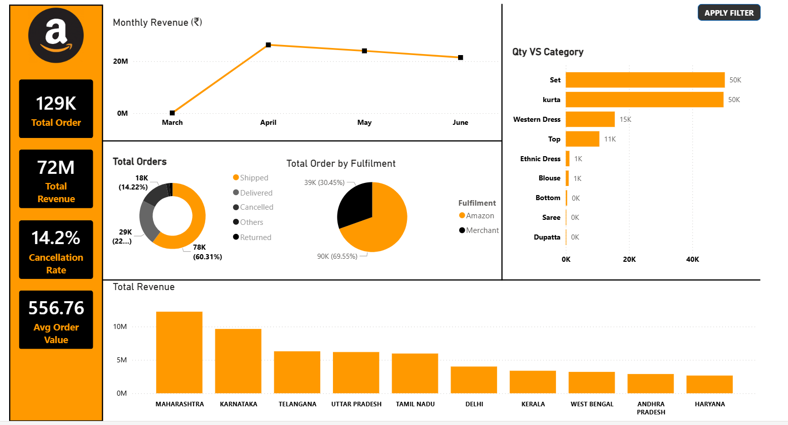

# Amazon India E-Commerce Sales Dashboard
### End-to-End Data Analysis | Python EDA + Power BI | Mar-Jun 2022



---

## Project Overview

This project presents a complete end-to-end data analysis of an Amazon India fashion
e-commerce store covering 128,943 orders from March to June 2022. The objective is
to help the business identify revenue trends, understand customer behavior, evaluate
logistics performance, and reduce cancellation rates through data-driven insights.

The project follows the full analyst workflow:

```
Raw Data --> Data Cleaning (Python) --> EDA (Python) --> Power BI Dashboard --> GitHub
```

---

## Problem Statement

The e-commerce company faces five key operational challenges that this analysis
addresses:

| Area | Business Question |
|------|-------------------|
| Financial Performance | Which months and categories drive the most revenue? |
| Customer Insights | Which states and segments generate the highest orders? |
| Logistics and Fulfillment | How does Amazon vs Merchant fulfillment compare? |
| Product Management | Which categories and sizes are in highest demand? |
| Customer Satisfaction | What is driving high cancellation and return rates? |

---

## Dataset Description

| Column | Description |
|--------|-------------|
| Order ID | Unique identifier for each order |
| Date | Order date (March 31 to June 29, 2022) |
| Status | Order status — Shipped, Cancelled, Delivered, Returned etc. |
| Fulfilment | Fulfilled by Amazon or Merchant |
| Sales Channel | Platform — Amazon.in or Non-Amazon |
| ship-service-level | Expedited or Standard shipping |
| Category | Product category — Kurta, Set, Western Dress, Top etc. |
| Size | Product size — XS, S, M, L, XL, XXL, 3XL etc. |
| Qty | Number of units ordered |
| Amount | Transaction amount in INR |
| ship-state | Indian state where the order was delivered |
| ship-city | City of delivery |
| B2B | Boolean flag — True if Business-to-Business order |

Source: Amazon India Sales Dataset | 128,949 rows | 23 columns

---

## Data Cleaning Approach

The cleaning followed a strict three-step sequence to ensure the median was
computed from valid order values only:

```python
# Step 1 — Set Amount = 0 for all Cancelled orders
# Nulls are intentionally left untouched at this stage
df.loc[df["Status"] == "Cancelled", "Amount"] = 0

# Step 2 — Compute median from non-zero, non-null values only
# This excludes cancelled zeros so the median reflects real orders
valid = df[(df["Amount"] > 0) & (df["Amount"].notnull())]
median_amount = valid["Amount"].median()  # Result: 625.0

# Step 3 — Fill remaining null Amount rows with the median
df["Amount"].fillna(median_amount, inplace=True)
```

Key cleaning decisions:

| Decision | Detail |
|----------|--------|
| Duplicates removed | 6 duplicate rows dropped |
| Cancelled + null rows | 7,563 rows — correctly set to 0 in Step 1 |
| Genuine null rows filled | Only 231 non-cancelled rows filled with median 625 |
| Median bias avoided | Median computed after zeroing cancelled rows |
| Unnamed column dropped | Unnamed: 22 column removed — entirely empty |

---

## Power BI Dashboard

### Layout Structure

The dashboard uses an Amazon-branded orange and black theme with the following layout:

```
+----------------+-----------------------------+----------------------+
|   KPI Cards    |   Monthly Revenue           |   Qty vs Category    |
|   (4 cards)    |   (Line Chart)              |   (Horizontal Bar)   |
+----------------+--------------+--------------+                      |
|                |  Order       |  Fulfilment  |                      |
|                |  Status      |  Split       |                      |
|                |  (Donut)     |  (Donut)     |                      |
+----------------+--------------+--------------+----------------------+
|         Total Revenue by State -- Top 10 States (Column Chart)     |
+--------------------------------------------------------------------+
```

---

### KPI Cards

Four summary cards are displayed on the left panel:

| Metric | Value | Description |
|--------|-------|-------------|
| Total Orders | 129K | Total orders placed across Mar-Jun 2022 |
| Total Revenue | 72M | Net revenue with cancelled orders set to zero |
| Cancellation Rate | 14.2% | Percentage of orders that were cancelled |
| Avg Order Value | 556.76 | Average revenue per order in INR |

---

### Chart 1 — Monthly Revenue (Line Chart)

- Type: Line chart with data point markers
- X-axis: Month (March, April, May, June)
- Y-axis: Total Revenue in INR Millions
- DAX Measure: `Total Revenue = SUM(sales[Clean Amount])`

| Month | Revenue | Orders |
|-------|---------|--------|
| March | 0.09M | 171 (partial month) |
| April | 26.28M | 49,056 (peak) |
| May | 23.98M | 42,032 |
| June | 21.41M | 37,684 |

Insight: April was the peak revenue month. Revenue declined steadily from April
to June, suggesting seasonal demand or one-time promotional activity in April.

---

### Chart 2 — Total Orders by Status (Donut Chart)

- Type: Donut chart
- Field: Status Group (13 raw statuses grouped into 5 clean categories)
- DAX Measure: `Total Orders = COUNTROWS(sales)`

| Status Group | Orders | Percentage |
|--------------|--------|------------|
| Shipped | 78K | 60.31% |
| Delivered | 29K | 22.31% |
| Cancelled | 18K | 14.22% |
| Returned | 2K | 1.51% |
| Others | 1K | 0.65% |

Insight: Only 22.31% of orders are confirmed delivered to the buyer. The 14.22%
cancellation rate is a significant operational concern requiring root cause analysis.

---

### Chart 3 — Total Orders by Fulfilment (Donut Chart)

- Type: Donut chart
- Field: Fulfilment (Amazon or Merchant)

| Fulfilment | Orders | Percentage |
|------------|--------|------------|
| Amazon | 90K | 69.55% |
| Merchant | 39K | 30.45% |

Insight: Amazon handles nearly 70% of all orders and generates a higher average
order value (565) compared to Merchant fulfillment (537).

---

### Chart 4 — Qty vs Category (Horizontal Bar Chart)

- Type: Horizontal bar chart
- X-axis: Total quantity sold
- Y-axis: Product category (9 categories)
- Sorted: Descending by quantity

| Category | Units Sold |
|----------|------------|
| Set | 50K |
| Kurta | 50K |
| Western Dress | 15K |
| Top | 11K |
| Ethnic Dress | 1K |
| Blouse | 1K |
| Bottom | 0.4K |
| Saree | 0.2K |
| Dupatta | 0.003K |

Insight: Set and Kurta together account for approximately 76% of all units sold.
These two categories are the primary revenue and volume drivers for the business.

---

### Chart 5 — Total Revenue by State (Column Chart — Top 10)

- Type: Clustered column chart
- X-axis: Top 10 states by revenue
- Y-axis: Total Revenue in INR Millions
- Filter applied: Top N filter set to Top 10, By value = Total Revenue

| Rank | State | Revenue |
|------|-------|---------|
| 1 | Maharashtra | 14.1M |
| 2 | Karnataka | 11.0M |
| 3 | Telangana | 7.3M |
| 4 | Uttar Pradesh | 7.2M |
| 5 | Tamil Nadu | 6.9M |
| 6 | Delhi | 4.5M |
| 7 | Kerala | 4.1M |
| 8 | West Bengal | 3.8M |
| 9 | Andhra Pradesh | 3.4M |
| 10 | Haryana | 3.0M |

Insight: Maharashtra and Karnataka together contribute approximately 35% of total
revenue and should be the priority focus for targeted marketing campaigns.

---

### Interactive Filters

The dashboard includes an APPLY FILTER button (top right corner) that reveals a
collapsible filter panel with three slicers:

| Slicer | Field | Purpose |
|--------|-------|---------|
| Status | Order Status | Filter all visuals by order status (Shipped, Cancelled etc.) |
| Category | Product Category | Filter by product category (Set, Kurta, Western Dress etc.) |
| State | ship-state | Filter by delivery state across India |

All five charts and all four KPI cards respond dynamically to these filters. Selecting
a state in the slicer, for example, updates every visual to show data for that state
only — enabling deep regional analysis without building separate pages.

---

## DAX Measures Used

```
Total Orders = COUNTROWS(sales)

Total Revenue = SUM(sales[Clean Amount])

Avg Order Value = DIVIDE([Total Revenue], [Total Orders])

Cancellation Rate =
DIVIDE(
    CALCULATE(COUNTROWS(sales), sales[Status] = "Cancelled"),
    [Total Orders]
)
```

---

## Key Findings Summary

### Financial Performance
- Total revenue of 71.77M INR across four months
- April was the peak month with 26.28M revenue and 49,056 orders
- Set and Kurta categories contribute 76% of all units sold
- Average order value stands at 556.76 INR

### Customer Insights
- Maharashtra is the number one state by both orders and revenue
- April recorded the highest cancellation count at 7,137 orders
- B2C orders account for 99.3% of revenue
- B2B has a higher average order value (642 INR vs 556 INR)

### Logistics and Fulfillment
- Amazon fulfills 69.55% of all orders
- 68.7% of customers prefer Expedited shipping over Standard
- Amazon-fulfilled orders generate higher average revenue per order

### Product and Inventory
- M and L sizes have the highest demand across all categories
- 3XL and XXL sizes are also significant — stock accordingly
- Top problematic SKU: JNE3797 with highest cancellation and return count

### Customer Satisfaction
- Cancellation rate: 14.22%
- Return rate: 1.63%
- Successful delivery rate: 84.15%

---

## Recommendations

1. Investigate April cancellations — identify root cause across state, category,
   and SKU dimensions to prevent recurrence in future peak months

2. Audit SKU JNE3797 — this SKU has the highest issue count combining
   cancellations and returns; review product quality, sizing accuracy, and listing

3. Prioritize M and L size inventory — highest demand sizes across all categories;
   avoid stockouts which could directly impact revenue

4. Focus marketing investment on Maharashtra and Karnataka — these two states
   alone drive 35% of total revenue and have the highest growth potential

5. Develop a B2B acquisition strategy — B2B currently contributes only 0.7% of
   orders but commands a 15% higher average order value than B2C

6. Run targeted Sunday promotions — Sunday consistently records the highest
   daily revenue across all months in the dataset

---

## Tools and Technologies

| Tool | Version | Purpose |
|------|---------|---------|
| Python | 3.x | Data cleaning and exploratory data analysis |
| Pandas | Latest | Data manipulation and aggregation |
| Matplotlib | Latest | Data visualization in notebook |
| Seaborn | Latest | Statistical plots and styling |
| Jupyter Notebook | Latest | Interactive analysis and documentation |
| Power BI Desktop | Latest | Dashboard design and DAX measures |
| Power BI Service | Latest | Publishing and sharing |
| GitHub | - | Version control and portfolio hosting |

---

## Repository Structure

```
ecommerce-sales-dashboard/
|
|-- README.md                        <- Project documentation (this file)
|-- sales_dataset.xlsx               <- Raw dataset (128,949 rows)
|-- Amazon_EDA_Final.ipynb           <- Python EDA and cleaning notebook
|-- ecommerce_dashboard.pbix         <- Power BI dashboard file
|
|-- screenshots/
     |-- dashboard_overview.png      <- Full dashboard screenshot
```


---

## Author

Tharun Kumar Srinivasan
AI and Data Science Enthusiast

LinkedIn: https://www.linkedin.com/in/tharunkumarsrini/
GitHub: https://github.com/Tharun-Design
EOF
